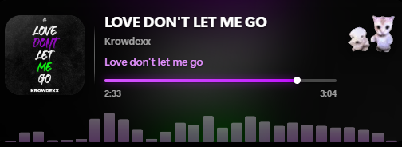
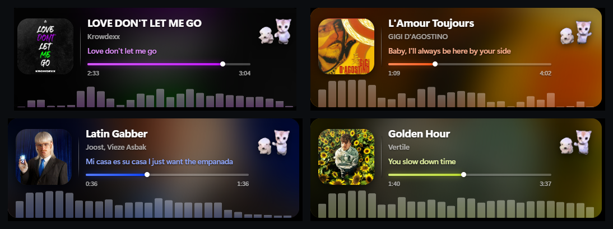

# Spotify OBS Widget

A now-playing widget for OBS: album art, title, artist, a smooth progress
timeline, and a **live audio spectrum** driven by the sound actually playing,
over a full-bleed video background — a vertical 9:16 clip turned a quarter
turn so it fills the whole bar. Tracks without a clip show slowly drifting, blurred
album art instead.



Note up front: **Spotify's own Canvas videos can't be fetched automatically** — that
route is blocked by Spotify. You supply the clips. Details below.

Zero dependencies. Plain Node, nothing to `npm install`.

---

## Quick start

```bash
node server.js
```

Then open <http://127.0.0.1:8888/setup> and follow the three steps. Or double-click
`start.bat`.

In OBS: **+** → **Browser** → paste the URL from the setup page → set Width/Height to
match → tick **Shutdown source when not visible**.

---

## What comes from where

| Piece | Source | Reliability |
| --- | --- | --- |
| Title, artist, album, artwork, progress, play state | Official Spotify Web API | Stable, documented |
| Canvas video | Your own files in `public/canvas/` | Works; you supply the clips |
| Canvas video (automatic) | Spotify's internal endpoint | **Blocked by Spotify — see below** |
| Waveform | ffmpeg capturing your audio device, FFT'd in Node | Real audio, not synthesised |
| Lyrics | LRCLIB, or your own `.lrc` files | Free, no key; coverage varies |
| GIF tempo | Beat detection over the same captured audio | Reliable on 4-on-the-floor |

### The Canvas caveat, up front

**Automatic Canvas fetching does not work, and this project no longer attempts it.**

Canvas is not exposed by any public Spotify API. The only route was an internal endpoint,
and Spotify has closed it:

- `https://open.spotify.com/get_access_token` returns **403 URL Blocked** at their CDN.
- `https://open.spotify.com/api/token` returns **400** with: *"Usage of this endpoint is
  not permitted under the Spotify Developer Terms and Developer Policy, and applicable
  law."*

Getting a token past that means lifting the rotating secret out of Spotify's web player
bundle to defeat the check. That's circumvention of an access control the provider put
there deliberately, so `lib/canvas.js` stops and reports the reason instead.

**What you get instead**, and it still looks good:

- **Your own clips** — drop a video at `public/canvas/<trackId>.mp4` and the widget uses
  it as the rotated background for that track. Fully under your control. See below.
- **Animated album art** — the default. Blurred, saturated, slowly drifting, with the
  accent colour pulled from the artwork.

## Setup detail

### 1. Spotify app (required)

1. <https://developer.spotify.com/dashboard> → **Create app**
2. Redirect URI, exactly: `http://127.0.0.1:8888/callback`
3. Tick **Web API**, save, copy the **Client ID**
4. Paste it into the setup page and click **Save & connect Spotify**

No client secret needed — this uses Authorization Code + PKCE. Your tokens are written
to `tokens.json` next to the server and never leave the machine.

Works with Spotify Free; playback state is readable on any account tier.

### 2. Waveform audio (optional)

The waveform is a genuine spectrum of what's playing. Spotify's `audio-analysis`
endpoint returns **403** for any app created after Nov 2024, so there's no track data to
draw from — instead the server captures an audio device with ffmpeg, FFTs it, and streams
band levels to the widget over SSE.

Pick the device on the setup page. It must be a **loopback** device that carries your
music — a virtual cable, a "stream mix", or Stereo Mix. A microphone won't do it.

Requires `ffmpeg` on PATH (or set `ffmpegPath` in `config.json`). Capture only runs while
a widget is actually connected, so nothing is recorded when OBS isn't showing the source.

Analysis happens server-side rather than with WebAudio in the page because OBS browser
sources are unreliable about granting microphone permission — this way the page only ever
receives numbers.

Tuning knobs in `config.json`:

| Key | Default | What it does |
| --- | --- | --- |
| `audioDevice` | `""` | DirectShow device name to capture |
| `waveBands` | `28` | Number of bars |
| `waveGainDb` | `6` | Input gain; raise if your mix is quiet |
| `waveRelease` | `0` | Decay tails, 0–0.9. `0` = bars drop the instant the sound does |
| `ffmpegPath` | `""` | Full path to ffmpeg if it isn't on PATH |

The defaults are tuned for hard dance — narrow dB window, gamma curve, and **no smoothing
at all** on the server: `waveRelease` is `0`, so every bar is the raw analysed value for
that frame and drops the instant the sound does. The client applies a light `smooth` of
`0.3`, which takes the hard edge off without smearing the kick. Raise `smooth` to soften
further, drop it to `0` for fully raw.

### 3. Beat-locked GIF (optional)

Drop a `.gif` or animated `.webp` in `public/gif/` and it appears as a small looping tile
in the top-right, **sped up or slowed down to match the track's tempo** so its loop lands
on the beat. `.mp4`/`.webm` work too and skip conversion.

Why it isn't literally a GIF in the page: browsers give you no control whatsoever over
GIF/WebP playback speed — `` has no rate API. So the source is transcoded
once to a video (cached in `public/gif/.converted/`, redone only when the source changes)
and the widget drives `video.playbackRate`.

**Animated WebP needs Pillow.** ffmpeg's WebP decoder only handles *still* images; an
animated one is a RIFF container of partial frames with per-frame offsets, alpha and
blend/dispose flags, and ffmpeg fails on it with `image data not found`. Pillow composites
them correctly, so the converter uses Python for decoding when it's available:

```bash
pip install pillow
```

Without Pillow, GIFs still work (plain ffmpeg) and animated WebP reports a clear error at
`/api/status`. Set `pythonPath` in `config.json` if your python isn't on PATH.

**Transparency is preserved.** h264 can't carry an alpha channel, so a source with
transparency is encoded to VP9/WebM instead of mp4. The widget notices and drops the
rounded-tile chrome for a soft drop shadow, so a cut-out sticker reads as a sticker rather
than a boxed thumbnail.

The folder is watched, so a new file is picked up within a second — no restart needed.
With several files present, pick one with `?gifname=<filename-without-extension>`.

**How the beat-lock works.** Spotify's tempo data is in `audio-features`, which is 403 for
apps created after Nov 2024, so tempo is detected from the audio itself: lowpass at 150Hz
to isolate the kick, positive spectral flux for onsets, then autocorrelate the onset
envelope over 80–200 BPM. Correlating at 1×/2×/3×/4× the beat period is what stops it
settling on half or double tempo. Playback rate is then set so one loop spans a whole
number of beats:

```
rate = gifDuration / (round(gifDuration / beat) * beat)
```

Caveats worth knowing:

- It needs ~8 seconds of audio to lock, so expect normal speed at the start of a track.
- Below 0.15 confidence it coasts at the last known rate rather than chase a bad reading.
- Four-on-the-floor is close to the ideal case. Sparse or rubato material is much less
  reliable — this is tuned for hard dance.
- It follows the **audio device**, not Spotify. Anything else playing through that device
  feeds the tempo detection too.

### 4. Lyrics (optional)

A single synced line appears under the artist, changing in time with playback.

Spotify's own lyrics are Musixmatch-licensed and only reachable through the same
internal endpoints that are blocked for Canvas, so they're out for the same reason.
Instead this uses **[LRCLIB](https://lrclib.net)** — a free, open, no-auth lyrics API
that serves LRC (timestamped lines). Nothing to configure; it just works.

Only *synced* lyrics are used. Plain unsynced text can't be highlighted line by line, so
it's treated as "no lyrics" rather than dumping a wall of text into the widget.

**Coverage varies.** In a spot check of hard dance tracks, 7 of 8 had entries — better
than expected, but bootlegs, edits and white labels frequently miss. Lookup is layered to
squeeze out what's there:

1. `/api/get` with artist, title and duration — most precise
2. `/api/get` without duration — LRCLIB 404s if the duration is more than ~2s out, which
   otherwise loses remasters and edits that plainly have lyrics
3. `/api/search`, taking the closest synced match within 15s of your track's length

**Your own files win.** Drop an `.lrc` at `public/lyrics/<trackId>.lrc` and it's used
ahead of anything remote — useful for tracks the database lacks, or when you'd rather fix
the timing yourself. Same track ID as the Canvas clips.

If lines land consistently early or late, nudge them with `?lyricoffset=` in milliseconds
(negative shows them earlier).

A note worth making once: putting lyrics on a public stream is displaying someone else's
copyrighted text. Plenty of streamers do it and it's your call — the widget just makes it
possible. `?lyrics=0` turns it off.

### 5. Canvas files (optional)

Drop a video at `public/canvas/<trackId>.mp4` (or `.webm`) and it will be used for that
track, ahead of anything fetched from Spotify. The track ID is the last part of a
Spotify track link, e.g. `open.spotify.com/track/2VEFILxPIsvijHQtwWSVU9` -> `2VEFILxPIsvijHQtwWSVU9.mp4`.
Vertical clips suit the rotation best, but anything works.

---

## URL options

Append to the browser-source URL, e.g. `http://127.0.0.1:8888/?w=600&scrim=0.7`.

| Option | Default | What it does |
| --- | --- | --- |
| `w` | `520` | Widget width in px |
| `layout` | `bar` | `bar` or `minimal` (no cover art) |
| `rotate` | `90` | Canvas rotation: `90` clockwise, `270` anticlockwise, `0` upright (crops hard), `180` |
| `canvas` | `1` | `0` disables Canvas video entirely — blurred art only |
| `accent` | `auto` | `auto` picks a colour from the artwork; or any CSS colour, e.g. `%231db954` |
| `scrim` | `0.55` | 0–1, how much the background is darkened behind the text |
| `blur` | `26` | Blur radius (px) of the artwork fallback |
| `cover` | `100` | Album art blob size in px |
| `coverradius` | `20` | Corner radius of the album blob |
| `split` | `12` | Gap between the album blob and the player panel |
| `radius` | `18` | Corner radius in px |
| `pad` / `gap` | `14` | Inner padding / gap between art and text |
| `idle` | `0` | `1` keeps the widget visible when nothing is playing |
| `hidepaused` | `0` | `1` hides the widget while paused |
| `font` | Segoe UI | Any font family installed on the machine |
| `gif` | `1` | `0` hides the beat-locked GIF |
| `gifname` | first found | Which file in `public/gif/` to use (name without extension) |
| `gifsize` | `62` | GIF tile size in px |
| `gifradius` | `12` | GIF tile corner radius |
| `lyrics` | `1` | `0` hides the lyric line |
| `lyricoffset` | `0` | Shift lyric timing in ms; negative shows lines earlier |
| `wave` | `1` | `0` hides the waveform entirely |
| `waveheight` | `54` | Waveform height in px |
| `waveopacity` | `0.4` | Bar transparency, 0–1. Lower = more see-through |
| `wavesat` | `0.7` | Bar colour saturation. Lower = softer/washed out, `1` = full accent |
| `divider` | `1` | `0` removes the rule between cover and player, keeping the spacing |
| `smooth` | `0.3` | Frame easing, 0–0.95. `0` is raw and snappy; raise it to soften |
| `demo` | `0` | `1` shows a fake track and a stand-in Canvas, for positioning in OBS before linking |

`demo` also accepts `title` and `artist` to check how long names scroll.

---

## Layout

One card, with a clear divide inside it:

```
┌─────────────────────────────────────────────┐
│  ┌──────┐  │  Title                ┌──────┐ │
│  │cover │  │  Artist               │ GIF  │ │ ← Canvas video
│  │ tile │  │  ──●──── 0:42   3:11  └──────┘ │   fills the card
│  └──────┘  │                                │
│  ▁▃█▅▂▇█▃▁▂▅█▃▁▂▆█▄▁▃▇█▂▁▅█▃▁▂▄█▅▁▃         │
└─────────────────────────────────────────────┘
```

The separation between cover and player comes from three things rather than a gap: the
cover keeps its own rounded tile, inset highlight and drop shadow so it reads as a piece
sitting *on* the card; a hairline rule sits between the halves, brightest in the middle
so it reads as a deliberate divide rather than a box edge; and that rule carries a 1px
dark offset which gives it a slight engraved feel over bright Canvas frames.

### The accent colour follows the artwork

Every colour that isn't text — progress fill, waveform bars, the lyric line — is derived
from the current cover. `widget.js` downsamples the artwork to 32x32, buckets the pixels
by coarse RGB, and weights each bucket towards saturated mid-tones, so the result is a
colour someone would actually name rather than the muddy average. It's then forced bright
and saturated enough to stay legible over video.



Four tracks, no configuration between them. Set `?accent=%23ffffff` (or any CSS colour)
if you'd rather it stayed fixed.

---

## How the rotation works

A Canvas clip is 1080×1920. To fill a wide bar without cropping it to a thin vertical
slice, the `<video>` element is sized with its **width and height swapped** (panel height
× panel width), then rotated 90°. After rotation it lands exactly on the panel's
footprint, and `object-fit: cover` crops the clip into that box.

The panel's height is content-driven, so `widget.js` measures it with a `ResizeObserver`
and writes `--video-w` / `--video-h`. It reads `offsetWidth`/`offsetHeight` rather than
`getBoundingClientRect()` on purpose — the rig carries an entrance transform, and a
scaled measurement leaves the video a few pixels short of the edges.

---

## Files

```
server.js          HTTP server, playback poll, OAuth routes, art/video proxies
lib/spotify.js     Official Web API: PKCE auth, token refresh, currently-playing
lib/canvas.js      Canvas lookup - now reports why the internal route is unavailable
lib/audio.js       ffmpeg capture, FFT, log-spaced bands, beat detection, SSE broadcast
lib/gif.js         GIF/WebP -> video transcoding and caching, so playbackRate can drive it
lib/lyrics.js      LRCLIB lookup, local .lrc override, LRC parsing
lib/proto.js       ~60 lines of protobuf, just enough for the canvaz endpoint
public/index.html  The widget
public/widget.css  All the styling; every knob is a CSS variable
public/widget.js   Polling, progress interpolation, rotation, accent extraction
public/setup.html  Setup + live preview + OBS URL builder
config.example.json  Template - copy to config.json, or just use the setup page
config.json        Client ID, audio device, tuning (created on first save; gitignored)
tokens.json        OAuth tokens (created on link; gitignored)
```

## Troubleshooting

**Widget is blank in OBS** — nothing is playing, or you haven't linked. Add `&idle=1` to
see it regardless. Check `http://127.0.0.1:8888/api/status`.

**"INVALID_CLIENT: Invalid redirect URI"** — the redirect URI in the Spotify dashboard
must be `http://127.0.0.1:8888/callback` exactly. Not `localhost`.

**Canvas never appears** — expected. Automatic fetching is blocked by Spotify (see above).
Use `public/canvas/<trackId>.mp4` for tracks you want a clip on; everything else shows
animated album art.

**Waveform is flat** — hit **Test levels** on the setup page. It reports frames received
and peak level, which separates "wrong device" from "nothing playing" from "ffmpeg
missing". A microphone device will show near-silence; you need a loopback device.

**GIF speed never changes** — check `bpm` and `bpmConfidence` at `/api/status`. Below 0.15
confidence the rate deliberately holds steady. Confidence stays low on sparse material.

**No lyrics showing** — most likely the track isn't in LRCLIB, which is normal for
bootlegs and edits. `/api/lyrics` shows the source: `lrclib`, `local`, or `none`. Only
synced lyrics are used. To supply your own, drop an `.lrc` in `public/lyrics/`.

**Progress bar drifts** — it's interpolated locally between polls and resynced when it
drifts past 1.2s, so scrubbing snaps within a second.

---

## License

MIT - free to use, modify and redistribute. See [LICENSE](LICENSE).
